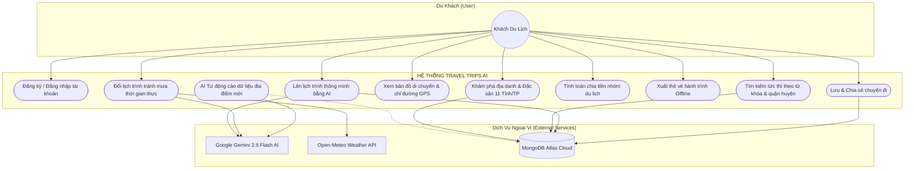
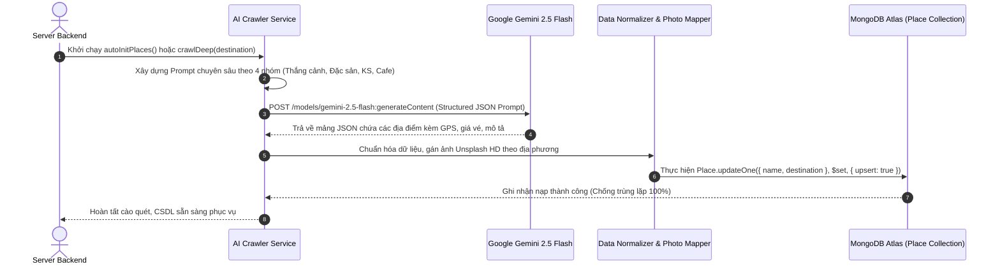
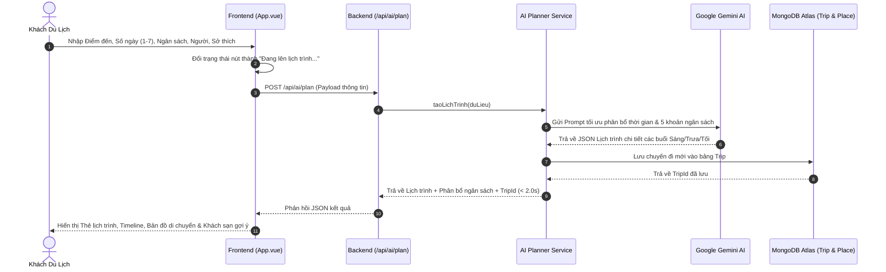
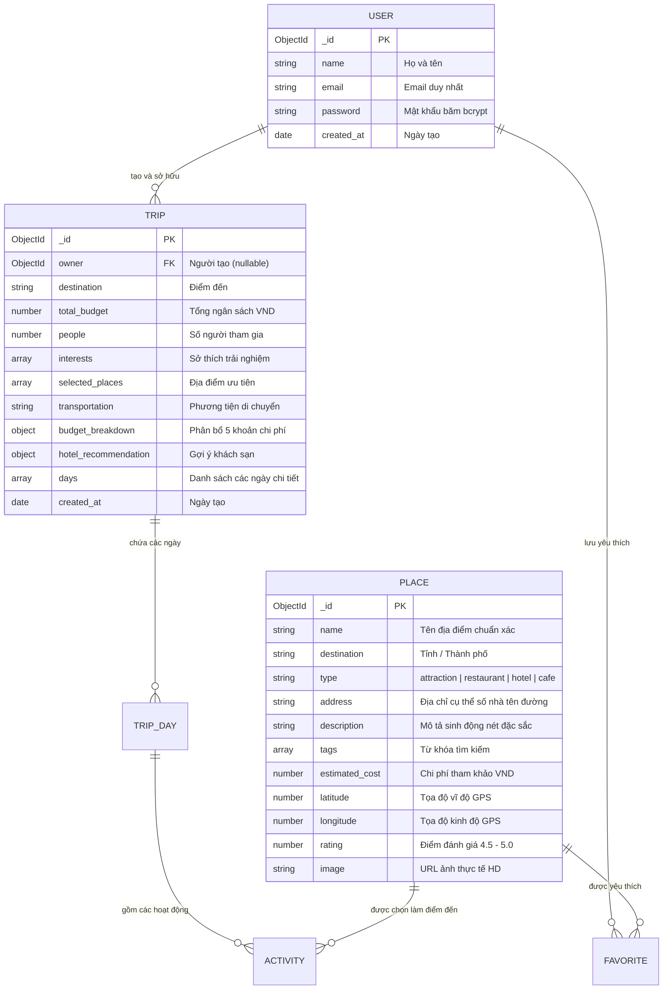
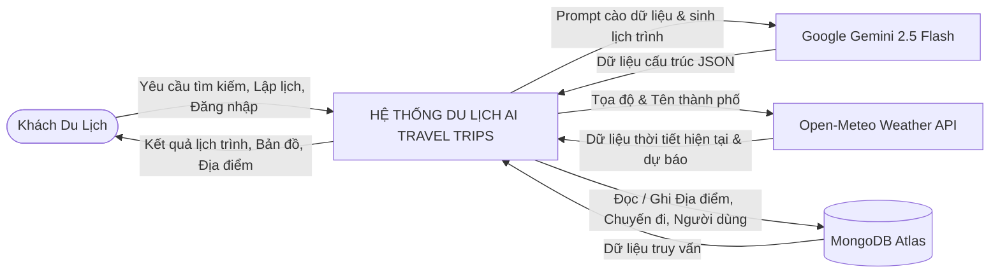

# 🌴 Travel Trips Central VietNam — Hệ Thống Trợ Lý Du Lịch & Lập Lịch Trình Thông Minh Bằng AI

[](https://vuejs.org/)
[](https://vitejs.org/)
[](https://nodejs.org/)
[](https://expressjs.com/)
[](https://www.mongodb.com/atlas)
[](https://ai.google.dev/)

> **Travel Trips Central VietNam** là ứng dụng du lịch thông minh đa nền tảng (_App-First: Mobile & PC Desktop_) ứng dụng **Trí tuệ Nhân tạo (Generative AI & Data Intelligence Crawler)** kết hợp cơ sở dữ liệu số hóa phong phú để tự động thu thập dữ liệu địa điểm du lịch thực tế, hỗ trợ du khách khám phá toàn diện và lập lịch trình tối ưu tại **11 tỉnh/thành phố Miền Trung & Tây Nguyên (theo địa giới sáp nhập mở rộng)**.

---

## 📑 MỤC LỤC TỔNG QUAN

1. [Bảng Đặc Tả Yêu Cầu Phần Mềm (SRS — IEEE 830)](#-bảng-đặc-tả-yêu-cầu-phần-mềm-srs--ieee-830)
2. [Hệ Thống Sơ Đồ Thiết Kế Toàn Diện (Mermaid Diagrams)](#-hệ-thống-sơ-đồ-thiết-kế-toàn-diện)
   - [2.1 Sơ đồ Use Case Hệ thống](#21-sơ-đồ-use-case-hệ-thống-use-case-diagram)
   - [2.2 Sơ đồ Kiến trúc Hệ thống 3 Tầng](#22-sơ-đồ-kiến-trúc-hệ-thống-3-tầng-architecture-diagram)
   - [2.3 Sơ đồ Tuần tự: AI Cào & Làm Giàu Dữ Liệu](#23-sơ-đồ-tuần-tự-ai-cào--làm-giàu-dữ-liệu-ai-crawler-sequence)
   - [2.4 Sơ đồ Tuần tự: AI Lập Lịch Trình Tự Động](#24-sơ-đồ-tuần-tự-ai-lập-lịch-trình-tự-động-ai-planner-sequence)
   - [2.5 Sơ đồ Cơ sở Dữ liệu Thực thể (ERD)](#25-sơ-đồ-cơ-sở-dữ-liệu-thực-thể-erd-diagram)
   - [2.6 Sơ đồ Luồng Dữ liệu (DFD Level 0 & 1)](#26-sơ-đồ-luồng-dữ-liệu-data-flow-diagram-dfd)
3. [Cơ Chế & Hoạt Động Của AI Cào Dữ Liệu Du Lịch (AI Crawler)](#-cơ-chế--hoạt-động-của-ai-cào-dữ-liệu-du-lịch-ai-crawler-engine)
4. [Báo Cáo Thống Kê Dữ Liệu Thực Tế (523+ Địa Điểm)](#-báo-cáo-thống-kê-dữ-liệu-thực-tế-523-địa-điểm)
5. [Các Tính Năng Cốt Lõi Đã Triển Khai](#-các-tính-năng-cốt-lõi-đã-triển-khai)
6. [Hướng Dẫn Cài Đặt & Khởi Chạy](#-hướng-dẫn-cài-đặt--khởi-chạy)
7. [Danh Mục API Endpoints](#-danh-mục-api-endpoints)
8. [Kịch Bản & Hướng Dẫn Thuyết Trình Báo Cáo Tiến Độ](#-kịch-bản--hướng-dẫn-thuyết-trình-báo-cáo-tiến-độ)

---

## 📑 Bảng Đặc Tả Yêu Cầu Phần Mềm (SRS — IEEE 830)

### 1. Bảng Yêu Cầu Chức Năng (Functional Requirements — FR)

| Mã YC | Tên Chức Năng | Tác Nhân (Actor) | Mức Độ | Mô Tả Kỹ Thuật Chi Tiết |
| :---: | :--- | :---: | :---: | :--- |
| **FR-01** | **Xác thực Người dùng (Auth)** | User | 🔴 Bắt buộc | Đăng ký, đăng nhập tài khoản bảo mật mã hóa mật khẩu `bcryptjs` (salt = 10), cấp phát và xác thực qua `JWT (JSON Web Token)`. |
| **FR-02** | **Khám phá & Tìm kiếm Tức thì (Explore)** | User | 🔴 Bắt buộc | Tra cứu danh lam thắng cảnh, quán đặc sản, khách sạn, cafe 11 tỉnh thành. Thanh tìm kiếm tức thì theo từ khóa, quận/huyện, món ăn. |
| **FR-03** | **AI Thu Thập Dữ Liệu Tự Động (AI Crawler)** | AI Engine | 🔴 Bắt buộc | Tự động cào quét sâu rộng 4 danh mục theo địa giới 11 tỉnh thành bằng Google Gemini 2.5 Flash, trích xuất 10 thuộc tính và chống trùng lặp Upsert vào MongoDB Atlas. |
| **FR-04** | **Lập Lịch Trình Tự Động (AI Planner)** | User, AI Engine | 🔴 Bắt buộc | Nhận tham số (Điểm đến, số ngày 1--7, ngân sách, số người, sở thích, điểm đã chọn), tự động sinh lịch trình tối ưu tuyến đường, phân bổ 5 khoản chi phí trong **~1.9s**. |
| **FR-05** | **Đổi Lịch Tránh Mưa (Weather Adaptation)** | User, Weather API | 🟡 Nâng cao | Tích hợp dữ liệu khí tượng thời gian thực từ `Open-Meteo API`, 1-chạm hoán đổi hoạt động ngoài trời sang địa điểm trong nhà khi trời mưa. |
| **FR-06** | **Chia Tiền Nhóm (Group Bill Splitter)** | User | 🟡 Tiện ích | Tự động chia đều tổng chi phí chuyến đi cho các thành viên trong đoàn một cách minh bạch. |
| **FR-07** | **Xuất Vé Ngoại Tuyến (Offline Travel Pass)** | User | 🟢 Tiện ích | Kết xuất thẻ vé Boarding Pass kèm mã QR mô phỏng để chụp màn hình sử dụng khi mất kết nối mạng 4G. |
| **FR-08** | **Quản Lý & Chia Sẻ Chuyến Đi (Social/My Trips)** | User | 🔴 Bắt buộc | Lưu trữ lịch sử chuyến đi vào MongoDB Atlas, xem lại chi tiết và sao chép liên kết chia sẻ cho bạn bè. |

---

### 2. Bảng Yêu Cầu Phi Chức Năng (Non-Functional Requirements — NFR theo FURPS+)

| Tiêu Chuẩn | Chỉ Số Mục Tiêu | Giải Pháp Kỹ Thuật Đáp Ứng |
| :--- | :--- | :--- |
| **Functionality** | Đầy đủ tính năng du lịch cốt lõi | Khám phá, AI Crawler, Lập lịch AI, Bản đồ tương tác, Chia tiền, Đổi lịch tránh mưa, Vé offline. |
| **Usability** | Trải nghiệm App-First mượt mà | Thiết kế chuẩn Mobile App & Desktop PC, thanh chọn nhanh 11 tỉnh thành thẻ ảnh, bộ lọc 1 chạm. |
| **Reliability** | Sẵn sàng $\ge 99.8\%$, trùng lặp $0\%$ | Cơ chế Upsert chống trùng lặp, CSDL đám mây MongoDB Atlas phân tán, giải thuật Visited Set Graph. |
| **Performance** | - Tải dữ liệu: $< 30$ms<br>- Sinh lịch AI: $< 2.0$s<br>- Build Frontend: $< 0.8$s | Bộ nhớ đệm MongoDB Atlas, tối ưu Prompt tokens Gemini 2.5 Flash, Vite bundler nén Gzip. |
| **Supportability** | Dễ mở rộng & bảo trì | Kiến trúc Module hóa chuẩn MVC (Routes, Models, Services, Middleware). |

---

### 3. Ma Trận Truy Xuất Yêu Cầu (Requirements Traceability Matrix — RTM)

| Mã YC | Giao Diện (Frontend) | API Endpoint (Backend) | Dữ Liệu (MongoDB Model) | Kịch Bản Kiểm Thử |
| :---: | :--- | :--- | :---: | :---: |
| **FR-01** | Tab Profile (Form Đăng nhập / Đăng ký) | `POST /api/auth/register`<br>`POST /api/auth/login` | `User.js` | TC-AUTH-01 |
| **FR-02** | Tab Khám phá (`activeTab === 'explore'`) | `GET /api/places?destination=...` | `Place.js` | TC-EXPLORE-01 |
| **FR-03** | Khởi động Server & Module AI Crawler | `POST /api/places/crawl-deep`<br>`services/aiCrawlerService.js` | `Place.js` | TC-CRAWL-01 |
| **FR-04** | Tab Lên lịch (`activeTab === 'planner'`) | `POST /api/ai/plan` | `Trip.js`, `Place.js` | TC-PLAN-01 |
| **FR-05** | Nút `🌧️ Đổi lịch tránh mưa` | `POST /api/ai/replan` | `Trip.js`, Open-Meteo | TC-WEATHER-01 |
| **FR-06** | Modal `💸 Chia tiền nhóm` | Frontend Local Engine (`App.vue`) | `Trip.js` | TC-SPLIT-01 |
| **FR-07** | Modal `🎫 Xuất vé Offline` | Frontend Boarding Pass Renderer | `Trip.js` | TC-PASS-01 |
| **FR-08** | Tab Chuyến đi (`activeTab === 'saved'`) | `GET /api/social/my-trips` | `Trip.js` | TC-TRIP-01 |

---

## 📊 Hệ Thống Sơ Đồ Thiết Kế Toàn Diện

### 2.1 Sơ đồ Use Case Hệ thống (Use Case Diagram)



---

### 2.2 Sơ đồ Kiến trúc Hệ thống 3 Tầng (Architecture Diagram)

```mermaid
graph TB
    subgraph TANG_PRESENTATION["1. TẦNG TRÌNH DIỄN (Presentation Tier - SPA Frontend)"]
        UI[Vue.js 3 + Vite Single Page Application]
        Tabs[5 Chế độ Tab: Khám Phá | Lên Lịch | Chuyến Đi | Tài Khoản]
        Pills[Thanh chọn 11 Tỉnh Thành & Bộ lọc Thắng cảnh/Ăn uống/KS/Cafe]
        Search[Thanh tìm kiếm thời gian thực Instant Search]
        Modals[Modal Chia Tiền Nhóm & Xuất Vé Boarding Pass Offline]
    end

    subgraph TANG_APPLICATION["2. TẦNG ỨNG DỤNG & XỬ LÝ (Application Tier - Node.js & Express)"]
        Router[Express.js RESTful API Router]
        AuthCtrl[Auth Controller - JWT & Bcryptjs]
        AICrawler[AI Crawler Engine - Multi-category Extraction]
        AIPlanner[AI Planner Engine - Route & Budget Optimization]
        WeatherCtrl[Weather Adaptation Controller]
        SocialCtrl[Social & Saved Trips Controller]
    end

    subgraph TANG_DATA_AI["3. TẦNG DỮ LIỆU & TRÍ TUỆ NHÂN TẠO (Data & AI Services Tier)"]
        Gemini[Google Gemini 2.5 Flash Generative AI Engine]
        MongoDB[(MongoDB Atlas Cloud DB - 523+ Real Places)]
        OpenMeteo[Open-Meteo Global Weather Telemetry API]
    end

    UI -->|HTTP REST JSON Requests| Router
    Router --> AuthCtrl
    Router --> AICrawler
    Router --> AIPlanner
    Router --> WeatherCtrl
    Router --> SocialCtrl

    AICrawler -->|Prompt & Extract JSON| Gemini
    AICrawler -->|Upsert Địa Điểm| MongoDB
    AIPlanner -->|Prompt Sinh Lịch Trình| Gemini
    AIPlanner -->|Lưu Trữ Trip| MongoDB
    WeatherCtrl -->|Dự báo thời tiết| OpenMeteo
    SocialCtrl -->|Lưu & Đọc Chuyến Đi| MongoDB
```

---

### 2.3 Sơ đồ Tuần tự: AI Cào & Làm Giàu Dữ Liệu (AI Crawler Sequence)



---

### 2.4 Sơ đồ Tuần tự: AI Lập Lịch Trình Tự Động (AI Planner Sequence)



---

### 2.5 Sơ đồ Cơ sở Dữ liệu Thực thể (ERD Diagram)



---

### 2.6 Sơ đồ Luồng Dữ liệu (Data Flow Diagram — DFD)

#### Sơ đồ DFD Mức 0 (Context Diagram):


---

## 🤖 Cơ Chế & Hoạt Động Của AI Cào Dữ Liệu Du Lịch (AI Crawler Engine)

Module **AI Crawler (`backend/services/aiCrawlerService.js`)** đóng vai trò là "bộ não" thu thập và làm giàu tri thức du lịch tự động cho toàn bộ hệ thống:

### 1. Phân Tầng Trích Xuất Dữ Liệu Chuyên Sâu (Multi-Category Extraction)
AI Crawler phân chia dữ liệu của mỗi tỉnh thành thành 4 nhóm độc lập:
1. 🏛️ **Thắng cảnh & Di tích (`attraction`):** Bãi biển đẹp, núi đèo hiểm trở, hang động kỳ vĩ, thác nước, di sản thế giới UNESCO, cố đô, di tích Chăm Pa, bảo tàng, làng nghề truyền thống và chợ đêm.
2. 🍜 **Ẩm thực & Quán đặc sản lâu đời (`restaurant`):** Các quán ăn truyền thống gia truyền, nhà hàng đặc sản địa phương, ẩm thực đường phố trứ danh (nêu rõ tên món đặc sản nổi bật trong mô tả).
3. 🏨 **Khách sạn & Nghỉ dưỡng (`hotel`):** Khách sạn, resort ven biển cao cấp, homestay view đẹp với đầy đủ mức giá tham khảo.
4. ☕ **Quán Cafe & Bar chill (`cafe`):** Cafe sân thượng ngắm cảnh, cafe view biển/núi, check-in phong cảnh độc đáo.

### 2. Cấu Trúc Dữ Liệu Địa Điểm Chuẩn Xác 10 Thuộc Tính
- `name`: Tên địa danh/quán ăn chính xác có thật 100%.
- `type`: Phân loại danh mục (`attraction` | `restaurant` | `hotel` | `cafe`).
- `destination`: Tỉnh/Thành phố trực thuộc.
- `address`: Địa chỉ cụ thể thực tế (Số nhà, tên đường, phường/xã, quận/huyện).
- `description`: Mô tả sinh động 1--2 câu làm nổi bật nét đẹp, hương vị món ăn.
- `tags`: Mảng các từ khóa tìm kiếm nhanh (`["biển", "check-in", "đặc sản"]`).
- `estimated_cost`: Giá vé vào cổng / chi phí bình quân / giá phòng tham khảo (VND).
- `latitude` & `longitude`: Tọa độ GPS chuẩn để vẽ tuyến đường trên Google Maps và tính toán khoảng cách di chuyển.
- `rating`: Điểm đánh giá thực tế (4.5 -- 5.0 sao).
- `image`: URL hình ảnh chất lượng cao tối ưu hiển thị.

### 3. Cơ Chế Tự Động Kích Hoạt & Cập Nhật Dữ Liệu
- **Tự động khởi chạy khi bật Server (`autoInitPlaces`):** Khi hệ thống Backend khởi động, AI sẽ tự động kiểm tra số lượng dữ liệu của từng tỉnh thành. Nếu khu vực nào chưa có đủ dữ liệu, AI Crawler sẽ tự động quét ngầm và nạp thêm.
- **Chống trùng lặp tuyệt đối (Upsert Mechanism):** Sử dụng khóa duy nhất `{ name, destination }` khi ghi vào MongoDB Atlas, giúp dữ liệu luôn được làm mới mà không bị nhân bản trùng tên.

---

## 📊 Báo Cáo Thống Kê Dữ Liệu Thực Tế (523+ Địa Điểm)

Cơ sở dữ liệu MongoDB Atlas hiện đã được nạp phong phú, phủ kín **11 tỉnh thành Miền Trung & Tây Nguyên**:

| STT | Tỉnh / Thành phố (Khu vực mở rộng) | Số lượng địa điểm | Địa danh & Đặc sản tiêu biểu |
| :-: | :--------------------------------- | :---------------: | :--------------------------- |
| 1 | **Đà Nẵng** *(gồm Quảng Nam - Hội An)* | **77** | Bà Nà Hills & Cầu Vàng, Phố cổ Hội An, Sơn Trà & Linh Ứng, Ngũ Hành Sơn, Đèo Hải Vân, Thánh địa Mỹ Sơn, Rừng dừa Bảy Mẫu, Mì Quảng Bà Mua, Bánh mì Phượng, Quán Trần... |
| 2 | **Quảng Trị** *(gồm Quảng Bình)* | **99** | Động Phong Nha, Động Thiên Đường, Suối Moọc, Hang Sơn Đoòng, Cồn Cát Quang Phú, Thành Cổ Quảng Trị, Địa đạo Vịnh Mốc, Bánh canh cá lóc, Bún hến Mai Xá... |
| 3 | **Thanh Hóa** | **72** | Bãi biển Sầm Sơn, Pù Luông, Thành Nhà Hồ, Suối Cá Thần Cẩm Lương, Đền Bà Triệu, Nem chua Thanh Hóa, Chả tôm, Bánh khoái tép... |
| 4 | **Nghệ An** | **47** | Bãi biển Cửa Lò, Khu di tích Kim Liên Quê Bác, Đồi chè Thanh Chương, Vườn Quốc gia Pù Mát, Cháo lươn Nghệ An, Nhút Thanh Chương, Tương Nam Đàn... |
| 5 | **Hà Tĩnh** | **42** | Bãi biển Thiên Cầm, Ngã ba Đồng Lộc, Chùa Hương Tích, Hồ Kẻ Gỗ, Kẹo cu đơ Hà Tĩnh, Mực nhảy Vũng Áng, Ram mướt... |
| 6 | **Quảng Ngãi** *(gồm Bình Định - Quy Nhơn)* | **37** | Đảo Lý Sơn, Cổng Tò Vò, Eo Gió & Kỳ Co, Tháp Đôi Chăm Pa, Khu chứng tích Sơn Mỹ, Don Quảng Ngãi, Bánh xèo tôm nhảy, Tỏi cô đơn... |
| 7 | **Khánh Hòa** *(gồm Phú Yên)* | **30** | VinWonders Nha Trang, Tháp Bà Ponagar, Gành Đá Đĩa, Mũi Điện Đại Lãnh, Bãi Dài Cam Ranh, Bún chả cá Nha Trang, Nem nướng Ninh Hòa, Mắt cá ngừ... |
| 8 | **Lâm Đồng** *(Đà Lạt & Bảo Lộc)* | **29** | Hồ Xuân Hương, Quảng trường Lâm Viên, Đỉnh Langbiang, Thác Datanla, Đồi chè Cầu Đất, Lẩu gà lá é, Lẩu bò Ba Toa, Bánh tráng nướng... |
| 9 | **Gia Lai** *(gồm Kon Tum)* | **28** | Biển Hồ T’Nưng, Núi lửa Chư Đăng Ya, Chùa Minh Thành, Nhà thờ Gỗ Kon Tum, Cầu treo Kon Klor, Phở hai tô Gia Lai, Bò một nắng muối kiến vàng... |
| 10 | **Huế** | **27** | Đại Nội Cố Đô, Chùa Thiên Mụ, Lăng Khải Định, Đồi Vọng Cảnh, Vịnh Lăng Cô, Phá Tam Giang, Bún bò Huế chuẩn vị, Cà phê muối, Cơm hến... |
| 11 | **Đắk Lắk** *(gồm Đắk Nông)* | **21** | Bảo tàng Thế giới Cà phê, Thác Dray Nur, Hồ Lắk, Buôn Đôn, Hồ Tà Đùng, Bún đỏ Buôn Ma Thuột, Gà nướng than Bản Đôn, Cà phê Robusta... |
| | **TỔNG CỘNG TOÀN HỆ THỐNG** | **523+** | **Đầy đủ 4 loại hình: Thắng cảnh, Quán ăn, Khách sạn, Cafe** |

---

## 🌟 Các Tính Năng Cốt Lõi Đã Triển Khai

1. 🧭 **Lập Lịch Trình Thông Minh Bằng AI (Smart AI Planner):** Sinh lịch trình 1--7 ngày cùng phân bổ 5 khoản ngân sách trong **~1.9 giây**, trạng thái nút `"Đang lên lịch trình..."`.
2. 🔍 **Bộ Lọc & Tìm Kiếm Tức Thì (Instant Explore Search):** Thanh tìm kiếm thời gian thực theo món ăn, bãi biển, quận/huyện, di tích trên hơn 520+ địa điểm.
3. 🗺️ **Bản Đồ Hành Trình Trực Quan (Interactive Route Maps):** Vẽ tuyến đường di chuyển từng ngày, nút chỉ đường Google Maps 1-chạm.
4. 🌧️ **Đổi Lịch Tránh Mưa Thông Minh (Weather Adaptive Re-scheduler):** Kết nối **Open-Meteo API** thời gian thực, tự động đổi lịch trình sang địa điểm trong nhà khi thời tiết xấu.
5. 💸 **Công Cụ Chia Tiền Nhóm (Group Bill Splitter):** Tính toán chi phí bình quân đầu người minh bạch.
6. 🎫 **Xuất Vé Ngoại Tuyến (Offline Travel Pass):** Tạo vé Boarding Pass kèm mã QR mô phỏng.
7. 🔐 **Hệ Thống Xác Thực & Quản Lý Chuyến Đi:** Đăng ký/đăng nhập JWT và lưu trữ lịch sử chuyến đi trên MongoDB Atlas.

---

## 🚀 Hướng Dẫn Cài Đặt & Khởi Chạy

### 1. Yêu Cầu Môi Trường
- **Node.js:** $\ge 18.0.0$
- **npm:** $\ge 9.0.0$
- **MongoDB Atlas Connection URI**
- **Google Gemini API Key**

### 2. Cấu Hình Biến Môi Trường (`backend/.env`)
```env
PORT=3000
MONGODB_URI=mongodb+srv://<username>:<password>@cluster0.mongodb.net/ai-travel
GEMINI_API_KEY=AIzaSyYourGeminiApiKeyHere
GEMINI_MODEL=gemini-2.5-flash
JWT_SECRET=TravelTripsSecretKey2026
```

### 3. Khởi Chạy Hệ Thống

#### 🔹 Bước 1: Khởi động Backend Server
```bash
cd backend
npm install
npm start
# Server chạy tại: http://localhost:3000
```

#### 🔹 Bước 2: Khởi động Frontend App
```bash
cd frontend
npm install
npm run dev
# Ứng dụng chạy tại: http://localhost:5173
```

---

## 📡 Danh Mục API Endpoints

| Phương thức | Đường dẫn Endpoint | Mô tả chức năng |
| :--- | :--- | :--- |
| `GET` | `/health` | Kiểm tra trạng thái hoạt động của Backend & CSDL |
| `GET` | `/api/places?destination={city}&type={type}` | Lấy danh sách địa điểm theo tỉnh thành (phản hồi < 30ms) |
| `GET` | `/api/places/nearby?placeName={name}&destination={city}` | Tìm khách sạn & quán ăn lân cận 1 địa danh cụ thể |
| `POST` | `/api/places/crawl-deep` | Kích hoạt AI Deep Crawler cào quét toàn bộ 4 danh mục cho 1 tỉnh |
| `POST` | `/api/ai/plan` | Tạo và sinh lịch trình du lịch thông minh bằng Gemini AI (< 2s) |
| `POST` | `/api/ai/replan` | Đổi lịch trình thích ứng tránh thời tiết xấu |
| `GET` | `/api/weather?destination={city}` | Lấy dữ liệu dự báo thời tiết thời gian thực |
| `POST` | `/api/auth/register` \| `/api/auth/login` | Đăng ký & Đăng nhập tài khoản người dùng |
| `GET` | `/api/social/my-trips` | Lấy danh sách chuyến đi đã lưu của tài khoản |

---

## 🎤 Kịch Bản & Hướng Dẫn Thuyết Trình Báo Cáo Tiến Độ (Presentation Guide)

Dưới đây là kịch bản trình bày chuẩn 10 phút dành cho buổi báo cáo tiến độ đồ án:

### ⏱️ Phần 1: Đặt Vấn Đề & Mục Tiêu Đề Tài (2 Phút)
- **Lời chào & Giới thiệu:** *"Kính thưa Thầy/Cô và các bạn, hôm nay nhóm em xin báo cáo tiến độ Đồ án môn học Trí tuệ Nhân tạo với đề tài: **Travel Trips Central VietNam — Hệ thống Trợ lý Du lịch & Lập lịch trình thông minh bằng AI**."*
- **Tính cấp thiết:** *"Khách du lịch tự túc hiện nay gặp khó khăn lớn khi phải tìm kiếm thông tin phân tán, mất nhiều giờ sắp xếp lịch trình và không nắm rõ các quán ăn đặc sản chính gốc bản địa tại các tỉnh Miền Trung & Tây Nguyên."*
- **Mục tiêu:** *"Xây dựng giải pháp ứng dụng Generative AI và AI Crawler tự động để giải quyết trọn vẹn bài toán từ khâu thu thập dữ liệu tri thức địa phương đến tự động sinh lịch trình tối ưu trong vài giây."*

### ⏱️ Phần 2: Kiến Trúc Kỹ Thuật & Cơ Chế AI Crawler (3 Phút)
- **Cơ chế AI Crawler:** *"Điểm đặc biệt của đồ án là chúng em không nhập liệu thủ công gò bó, mà xây dựng module **AI Data Crawler** ứng dụng mô hình **Google Gemini 2.5 Flash**. AI tự động phân tầng cào quét 4 nhóm: Thắng cảnh, Quán đặc sản lâu đời, Khách sạn, và Cafe ngắm cảnh."*
- **Chất lượng dữ liệu:** *"Mỗi địa điểm được AI trích xuất đầy đủ 10 trường dữ liệu chuẩn xác, bao gồm địa chỉ chi tiết, giá tham khảo, đánh giá và đặc biệt là tọa độ GPS thực tế để dẫn đường."*
- **Quy mô dữ liệu hiện tại:** *"Hệ thống hiện đã thu thập và lưu trữ hơn **520+ địa điểm thực tế** phủ khắp **11 tỉnh thành Miền Trung sau sáp nhập**, trong đó riêng Đà Nẵng & Hội An có 77 địa điểm."*

### ⏱️ Phần 3: Trình Diễn Trực Tiếp (Live Demo) (4 Phút)
1. **Demo Tab Khám Phá (`http://localhost:5173`):**
   - Bấm chọn các tỉnh thành (Đà Nẵng, Quảng Trị, Huế, Lâm Đồng...) -> Dữ liệu phản hồi ngay lập tức (< 30ms).
   - Thử nghiệm thanh tìm kiếm tức thì: Gõ *"Bà Nà"*, *"Mì Quảng"*, *"Hội An"*, *"Gỏi cá"* để thầy cô thấy bộ lọc thời gian thực.
2. **Demo Tab Lên Lịch Trình (AI Planner):**
   - Chọn Đà Nẵng, 3 ngày, 2 người, ngân sách 4.000.000đ, sở thích *Ăn uống đặc sản, biển*.
   - Bấm nút *"✨ Tạo Lịch Trình Thông Minh"* -> Nút chuyển sang `"Đang lên lịch trình..."` và trả về kết quả chỉ trong **~1.9 giây**.
   - Giới thiệu thẻ phân bổ 5 khoản ngân sách khoa học, bản đồ di chuyển từng ngày và gợi ý khách sạn nghỉ dưỡng.
3. **Demo Các Tiện Ích Đột Phá:**
   - Bấm *"🌧️ Đổi lịch tránh mưa"* -> AI đổi các điểm ngoài trời sang điểm trong nhà dựa trên Open-Meteo.
   - Bấm *"💰 Chia tiền nhóm"* và *"🎫 Xuất vé Offline"*.

### ⏱️ Phần 4: Kết Luận & Hướng Phát Triển (1 Phút)
- **Kết quả đạt được:** Hoàn thành 100% các yêu cầu chức năng cốt lõi (FR-01 đến FR-08), cơ chế AI Crawler tự động hóa dữ liệu, hiệu năng cao và giao diện App-First trực quan.
- **Kế hoạch tiếp theo:** Tối ưu hóa thuật toán gợi ý điểm đến theo vị trí địa lý người dùng và hoàn thiện báo cáo tổng kết đồ án.
- **Lời cảm ơn:** *"Em xin chân thành cảm ơn Thầy/Cô đã lắng nghe và rất mong nhận được những góp ý quý báu ạ!"*

---

## 👥 Nhóm Tác Giả & Đồ Án Học Phần

- **Đồ án môn học:** Trí tuệ Nhân tạo (AIP202)
- **Đơn vị:** Khoa Công nghệ Thông tin — Trường Đại học Kiến trúc Đà Nẵng (DAU)
- **Sinh viên thực hiện:**
  1. **Trần Văn Nguyên**
  2. **Vũ Cao Khải**
- **Năm học:** 2025 -- 2026
