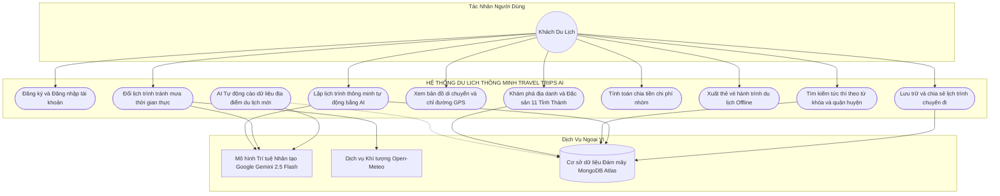
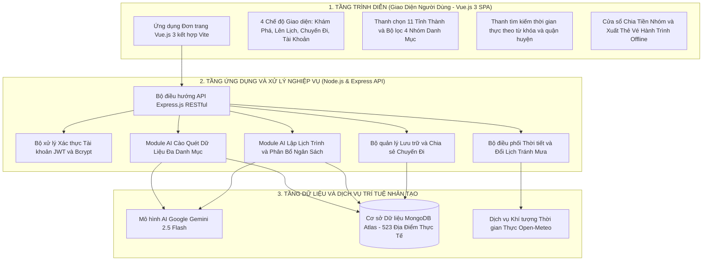
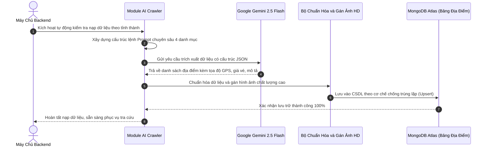
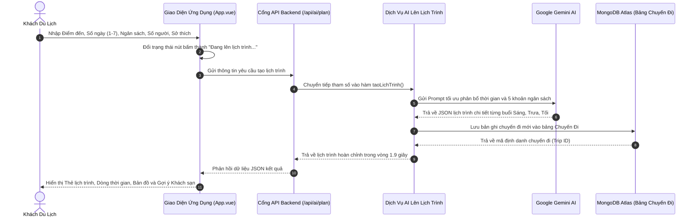
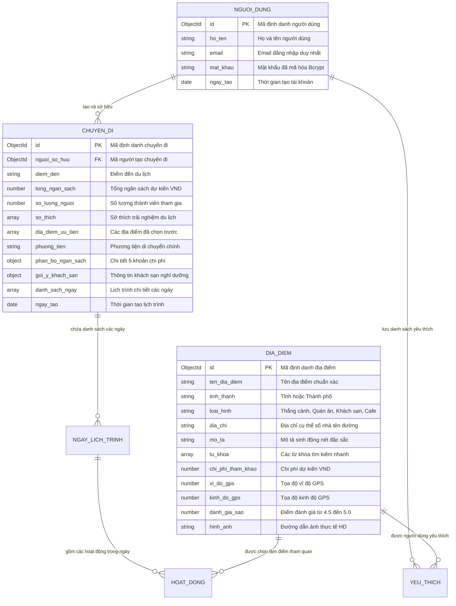
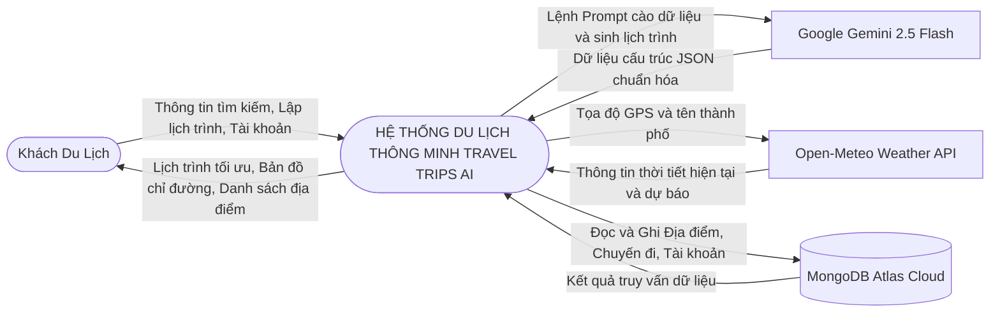

# 🌴 Travel Trips Central VietNam — Hệ Thống Trợ Lý Du Lịch & Lập Lịch Trình Thông Minh Bằng AI

[](https://vuejs.org/)
[](https://vitejs.org/)
[](https://nodejs.org/)
[](https://expressjs.com/)
[](https://www.mongodb.com/atlas)
[](https://ai.google.dev/)

> **Travel Trips Central VietNam** là ứng dụng du lịch thông minh đa nền tảng (_Giao diện chuẩn App di động & Máy tính PC_) ứng dụng **Trí tuệ Nhân tạo (Generative AI & Data Intelligence Crawler)** kết hợp cơ sở dữ liệu số hóa phong phú để tự động thu thập thông tin địa điểm du lịch thực tế, hỗ trợ du khách khám phá toàn diện và lập lịch trình tối ưu tại **11 tỉnh/thành phố Miền Trung & Tây Nguyên (theo địa giới sáp nhập mở rộng)**.

---

## 📑 MỤC LỤC TỔNG QUAN

1. [Bảng Đặc Tả Yêu Cầu Phần Mềm (SRS — Chuẩn IEEE 830)](#1-bảng-đặc-tả-yêu-cầu-phần-mềm-srs--chuẩn-ieee-830)
2. [Hệ Thống Sơ Đồ Thiết Kế Hệ Thống Toàn Diện](#2-hệ-thống-sơ-đồ-thiết-kế-hệ-thống-toàn-diện)
   - [2.1 Sơ đồ Ca sử dụng Hệ thống (Use Case Diagram)](#21-sơ-đồ-ca-sử-dụng-hệ-thống-use-case-diagram)
   - [2.2 Sơ đồ Kiến trúc Hệ thống 3 Tầng (Architecture Diagram)](#22-sơ-đồ-kiến-trúc-hệ-thống-3-tầng-architecture-diagram)
   - [2.3 Sơ đồ Tuần tự: AI Cào & Làm Giàu Dữ Liệu Địa Điểm](#23-sơ-đồ-tuần-tự-ai-cào--làm-giàu-dữ-liệu-địa-điểm)
   - [2.4 Sơ đồ Tuần tự: AI Lập Lịch Trình Tự Động](#24-sơ-đồ-tuần-tự-ai-lập-lịch-trình-tự-động)
   - [2.5 Sơ đồ Cơ sở Dữ liệu Thực thể Liên kết (ERD)](#25-sơ-đồ-cơ-sở-dữ-liệu-thực-thể-liên-kết-erd)
   - [2.6 Sơ đồ Luồng Dữ liệu (DFD Mức Ngữ Cảnh 0)](#26-sơ-đồ-luồng-dữ-liệu-dfd-mức-ngữ-cảnh-0)
3. [Cơ Chế & Hoạt Động Của AI Cào Dữ Liệu Du Lịch (AI Crawler)](#3-cơ-chế--hoạt-động-của-ai-cào-dữ-liệu-du-lịch-ai-crawler)
4. [Báo Cáo Thống Kê Dữ Liệu Thực Tế (523+ Địa Điểm)](#4-báo-cáo-thống-kê-dữ-liệu-thực-tế-523-địa-điểm)
5. [Các Tính Năng Cốt Lõi Đã Triển Khai](#5-các-tính-năng-cốt-lõi-đã-triển-khai)
6. [Hướng Dẫn Cài Đặt & Khởi Chạy](#6-hướng-dẫn-cài-đặt--khởi-chạy)
7. [Danh Mục API Endpoints](#7-danh-mục-api-endpoints)

---

## 1. Bảng Đặc Tả Yêu Cầu Phần Mềm (SRS — Chuẩn IEEE 830)

### 1.1 Bảng Yêu Cầu Chức Năng (Functional Requirements — FR)

| Mã Yêu Cầu | Tên Chức Năng | Tác Nhân | Mức Độ | Mô Tả Kỹ Thuật Chi Tiết |
| :---: | :--- | :---: | :---: | :--- |
| **FR-01** | **Xác thực Tài khoản** | Người dùng | 🔴 Bắt buộc | Đăng ký, đăng nhập tài khoản bảo mật bằng thuật toán băm mật khẩu `bcryptjs` (salt = 10), cấp phát và xác thực phiên qua `JWT (JSON Web Token)`. |
| **FR-02** | **Khám phá & Tìm kiếm Tức thì** | Người dùng | 🔴 Bắt buộc | Tra cứu danh lam thắng cảnh, quán đặc sản, khách sạn, cafe 11 tỉnh thành. Tìm kiếm nhanh thời gian thực theo từ khóa, quận/huyện, tên món ăn. |
| **FR-03** | **AI Thu Thập Dữ Liệu Tự Động** | Module AI | 🔴 Bắt buộc | Tự động cào quét sâu rộng 4 danh mục theo 11 tỉnh thành bằng Google Gemini 2.5 Flash, trích xuất 10 thuộc tính thực tế và chống trùng lặp Upsert vào MongoDB Atlas. |
| **FR-04** | **Lập Lịch Trình Tự Động Bằng AI** | Người dùng, AI | 🔴 Bắt buộc | Nhận tham số (Điểm đến, số ngày 1--7, ngân sách, số người, sở thích), tự động sinh lịch trình tối ưu tuyến đường, phân bổ 5 khoản chi phí trong **~1.9 giây**. |
| **FR-05** | **Đổi Lịch Tránh Mưa Thông Minh** | Người dùng, AI, Khí tượng | 🟡 Nâng cao | Tích hợp dữ liệu thời tiết thời gian thực từ `Open-Meteo API`, tự động hoặc 1-chạm hoán đổi hoạt động ngoài trời sang địa điểm trong nhà khi trời mưa. |
| **FR-06** | **Công Cụ Chia Tiền Nhóm** | Người dùng | 🟡 Tiện ích | Tự động chia đều tổng chi phí chuyến đi cho các thành viên trong đoàn một cách chính xác và minh bạch. |
| **FR-07** | **Xuất Thẻ Vé Ngoại Tuyến** | Người dùng | 🟢 Tiện ích | Kết xuất thẻ vé Boarding Pass kèm mã QR mô phỏng để chụp màn hình sử dụng thuận tiện khi mất kết nối mạng 4G. |
| **FR-08** | **Quản Lý & Lưu Trữ Chuyến Đi** | Người dùng | 🔴 Bắt buộc | Lưu trữ lịch sử chuyến đi vào MongoDB Atlas đám mây, xem lại chi tiết và sao chép liên kết chia sẻ cho bạn bè. |

---

### 1.2 Bảng Yêu Cầu Phi Chức Năng (Non-Functional Requirements — NFR theo chuẩn FURPS+)

| Tiêu Chuẩn Đánh Giá | Chỉ Số Mục Tiêu | Giải Pháp Kỹ Thuật Đáp Ứng |
| :--- | :--- | :--- |
| **Chức năng (Functionality)** | Đầy đủ tính năng du lịch cốt lõi | Khám phá, AI Crawler, Lập lịch AI, Bản đồ tương tác, Chia tiền nhóm, Đổi lịch tránh mưa, Vé offline. |
| **Khả năng Sử dụng (Usability)** | Trải nghiệm mượt mà, dễ dùng | Giao diện chuẩn App di động & PC Desktop, thanh chọn 11 tỉnh thành thẻ ảnh trực quan, bộ lọc 1-chạm. |
| **Độ tin cậy (Reliability)** | Sẵn sàng $\ge 99.8\%$, trùng lặp $0\%$ | Cơ chế Upsert chống trùng lặp, cơ sở dữ liệu đám mây MongoDB Atlas Cluster phân tán. |
| **Hiệu năng (Performance)** | - Tải dữ liệu: $< 30$ms<br>- Sinh lịch AI: $< 2.0$s<br>- Build Frontend: $< 0.8$s | Bộ nhớ đệm MongoDB Atlas, tối ưu Prompt tokens Gemini 2.5 Flash, đóng gói nén mã nguồn Vite Gzip. |
| **Khả năng Bảo trì (Supportability)** | Dễ dàng mở rộng & bảo trì | Kiến trúc phân tầng rõ ràng (Định tuyến Routes, Mô hình Models, Dịch vụ AI Services, Bộ trung gian Middleware). |

---

## 2. Hệ Thống Sơ Đồ Thiết Kế Hệ Thống Toàn Diện

### 2.1 Sơ đồ Ca sử dụng Hệ thống (Use Case Diagram)



**Mô tả phân tích sơ đồ Ca sử dụng:**
- **Tác nhân chính (Khách Du Lịch):** Tương tác trực tiếp với các chức năng cốt lõi gồm khám phá điểm đến, tìm kiếm địa danh/đặc sản, lập lịch trình thông minh, đổi lịch tránh mưa, chia tiền nhóm và xuất thẻ vé offline.
- **Tiến trình ngầm (AI Tự động cào dữ liệu):** Hoạt động tự trị kết nối giữa Google Gemini AI và MongoDB Atlas nhằm cập nhật tri thức du lịch mới liên tục.
- **Dịch vụ ngoại vi:** Bao gồm Google Gemini 2.5 Flash (sinh ngôn ngữ và bóc tách dữ liệu), Open-Meteo API (dữ liệu khí tượng thời gian thực) và MongoDB Atlas Cloud (lưu trữ phân tán).

---

### 2.2 Sơ đồ Kiến trúc Hệ thống 3 Tầng (Architecture Diagram)



**Mô tả phân tích kiến trúc 3 tầng:**
- **Tầng 1 — Trình diễn (Presentation Tier):** Ứng dụng Single Page Application (SPA) phát triển trên nền Vue.js 3 và Vite, đảm bảo tốc độ tải nhanh, giao diện linh hoạt chuẩn App-First hỗ trợ chế độ giả lập điện thoại và màn hình máy tính.
- **Tầng 2 — Ứng dụng & Nghiệp vụ (Application Tier):** Máy chủ Node.js & Express.js điều phối toàn bộ các dịch vụ bảo mật JWT, module AI Crawler bóc tách dữ liệu địa phương, thuật toán lập lịch trình tối ưu và xử lý thích ứng thời tiết.
- **Tầng 3 — Dữ liệu & Trí tuệ Nhân tạo (Data & AI Tier):** Cung cấp tài nguyên tính toán từ Google Gemini 2.5 Flash, hệ quản trị cơ sở dữ liệu NoSQL đám mây MongoDB Atlas với hơn 520+ bản ghi địa điểm và cổng dữ liệu khí tượng Open-Meteo.

---

### 2.3 Sơ đồ Tuần tự: AI Cào & Làm Giàu Dữ Liệu Địa Điểm



**Mô tả phân tích luồng AI Cào Dữ Liệu:**
- Hệ thống tự động kích hoạt kiểm tra số lượng địa điểm của từng tỉnh thành khi khởi động.
- Module AI Crawler áp dụng kỹ thuật Prompt Engineering theo 4 danh mục độc lập (Thắng cảnh, Ẩm thực đặc sản, Khách sạn, Cafe), yêu cầu Gemini AI trích xuất mảng JSON chuẩn xác.
- Dữ liệu được chuẩn hóa đầy đủ 10 thuộc tính, gán tọa độ GPS thực tế và thực hiện cập nhật theo cơ chế Upsert vào MongoDB Atlas để loại trừ trùng lặp dữ liệu.

---

### 2.4 Sơ đồ Tuần tự: AI Lập Lịch Trình Tự Động



**Mô tả phân tích luồng AI Lập Lịch Trình:**
- Khi người dùng gửi yêu cầu, giao diện chuyển sang trạng thái chờ `"Đang lên lịch trình..."`.
- Backend chuyển tiếp tham số cho AI Service, gọi Google Gemini để phân bổ tuyến đường hợp lý và tính toán 5 khoản chi phí (khách sạn, ăn uống, di chuyển, vé tham quan, dự phòng).
- Bản ghi chuyến đi được lưu vào MongoDB Atlas và phản hồi về giao diện người dùng chỉ trong khoảng **~1.9 giây**.

---

### 2.5 Sơ đồ Cơ sở Dữ liệu Thực thể Liên kết (ERD)



**Mô tả phân tích cấu trúc dữ liệu:**
- Bảng `NGUOI_DUNG` quản lý thông tin xác thực tài khoản.
- Bảng `DIA_DIEM` lưu trữ kho dữ liệu phong phú với 10 thuộc tính (GPS, giá vé, hình ảnh, đánh giá, loại hình).
- Bảng `CHUYEN_DI` liên kết với người dùng và lưu trữ chi tiết lịch trình nhiều ngày kèm phân bổ ngân sách.

---

### 2.6 Sơ đồ Luồng Dữ liệu (DFD Mức Ngữ Cảnh 0)



**Mô tả luồng thông tin DFD:**
- Người dùng truyền tham số tìm kiếm hoặc tạo lịch trình vào hệ thống.
- Hệ thống gửi prompt tới Gemini AI để nhận cấu trúc lịch trình, đồng thời truy vấn Open-Meteo để thu thập thời tiết thời gian thực và đồng bộ dữ liệu vào cơ sở dữ liệu MongoDB Atlas.

---

## 3. Cơ Chế & Hoạt Động Của AI Cào Dữ Liệu Du Lịch (AI Crawler)

Module **AI Crawler (`backend/services/aiCrawlerService.js`)** đóng vai trò là "bộ não" thu thập và làm giàu tri thức du lịch tự động cho toàn bộ hệ thống mà không cần nhập liệu thủ công gò bó:

### 3.1 Phân Tầng Trích Xuất Dữ Liệu Chuyên Sâu (Multi-Category Extraction)
AI Crawler phân chia dữ liệu của mỗi tỉnh thành thành 4 nhóm độc lập:
1. 🏛️ **Thắng cảnh & Di tích (`attraction`):** Bãi biển đẹp, núi đèo hiểm trở, hang động kỳ vĩ, thác nước, di sản thế giới UNESCO, cố đô, di tích Chăm Pa, bảo tàng, làng nghề truyền thống và chợ đêm.
2. 🍜 **Ẩm thực & Quán đặc sản lâu đời (`restaurant`):** Các quán ăn truyền thống gia truyền, nhà hàng đặc sản địa phương, ẩm thực đường phố trứ danh (nêu rõ tên món đặc sản nổi bật trong mô tả).
3. 🏨 **Khách sạn & Nghỉ dưỡng (`hotel`):** Khách sạn, resort ven biển cao cấp, homestay view đẹp với đầy đủ mức giá tham khảo.
4. ☕ **Quán Cafe & Bar chill (`cafe`):** Cafe sân thượng ngắm cảnh, cafe view biển/núi, check-in phong cảnh độc đáo.

### 3.2 Cấu Trúc Dữ Liệu Địa Điểm Chuẩn Xác 10 Thuộc Tính
- `name`: Tên địa danh/quán ăn chính xác có thật 100%.
- `type`: Phân loại danh mục (`attraction` | `restaurant` | `hotel` | `cafe`).
- `destination`: Tỉnh/Thành phố trực thuộc.
- `address`: Địa chỉ cụ thể thực tế (Số nhà, tên đường, phường/xã, quận/huyện).
- `description`: Mô tả sinh động 1--2 câu làm nổi bật nét đẹp, hương vị món ăn.
- `tags`: Mảng các từ khóa tìm kiếm nhanh (`["biển", "check-in", "đặc sản"]`).
- `estimated_cost`: Giá vé vào cổng / chi phí bình quân / giá phòng tham khảo (VND).
- `latitude` & `longitude`: Tọa độ GPS chuẩn để vẽ tuyến đường trên Google Maps và tính toán khoảng cách di chuyển.
- `rating`: Điểm đánh giá thực tế (4.5 -- 5.0 sao).
- `image`: URL hình ảnh chất lượng cao tối ưu hiển thị.

### 3.3 Cơ Chế Tự Động Kích Hoạt & Cập Nhật Dữ Liệu
- **Tự động khởi chạy khi bật Server (`autoInitPlaces`):** Khi hệ thống Backend khởi động, AI sẽ tự động kiểm tra số lượng dữ liệu của từng tỉnh thành. Nếu khu vực nào chưa có đủ dữ liệu, AI Crawler sẽ tự động quét ngầm và nạp thêm.
- **Chống trùng lặp tuyệt đối (Upsert Mechanism):** Sử dụng khóa duy nhất `{ name, destination }` khi ghi vào MongoDB Atlas, giúp dữ liệu luôn được làm mới mà không bị nhân bản trùng tên.

---

## 4. Báo Cáo Thống Kê Dữ Liệu Thực Tế (523+ Địa Điểm)

Cơ sở dữ liệu MongoDB Atlas hiện đã được nạp phong phú, phủ kín **11 tỉnh thành Miền Trung & Tây Nguyên**:

| STT | Tỉnh / Thành phố (Khu vực mở rộng) | Số lượng địa điểm | Địa danh & Đặc sản tiêu biểu |
| :-: | :--------------------------------- | :---------------: | :--------------------------- |
| 1 | **Đà Nẵng** *(gồm Quảng Nam - Hội An)* | **77** | Bà Nà Hills & Cầu Vàng, Phố cổ Hội An, Sơn Trà & Linh Ứng, Ngũ Hành Sơn, Đèo Hải Vân, Thánh địa Mỹ Sơn, Rừng dừa Bảy Mẫu, Mì Quảng Bà Mua, Bánh mì Phượng, Quán Trần... |
| 2 | **Quảng Trị** *(gồm Quảng Bình)* | **99** | Động Phong Nha, Động Thiên Đường, Suối Moọc, Hang Sơn Đoòng, Cồn Cát Quang Phú, Thành Cổ Quảng Trị, Địa đạo Vịnh Mốc, Bánh canh cá lóc, Bún hến Mai Xá... |
| 3 | **Thanh Hóa** | **72** | Bãi biển Sầm Sơn, Pù Luông, Thành Nhà Hồ, Suối Cá Thần Cẩm Lương, Đền Bà Triệu, Nem chua Thanh Hóa, Chả tôm, Bánh khoái tép... |
| 4 | **Nghệ An** | **47** | Bãi biển Cửa Lò, Khu di tích Kim Liên Quê Bác, Đồi chè Thanh Chương, Vườn Quốc gia Pù Mát, Cháo lươn Nghệ An, Nhút Thanh Chương, Tương Nam Đàn... |
| 5 | **Hà Tĩnh** | **42** | Bãi biển Thiên Cầm, Ngã ba Đồng Lộc, Chùa Hương Tích, Hồ Kẻ Gỗ, Kẹo cu đơ Hà Tĩnh, Mực nhảy Vũng Áng, Ram mướt... |
| 6 | **Quảng Ngãi** *(gồm Bình Định - Quy Nhơn)* | **37** | Đảo Lý Sơn, Cổng Tò Vò, Eo Gió & Kỳ Co, Tháp Đôi Chăm Pa, Khu chứng tích Sơn Mỹ, Don Quảng Ngãi, Bánh xèo tôm nhảy, Tỏi cô đơn... |
| 7 | **Khánh Hòa** *(gồm Phú Yên)* | **30** | VinWonders Nha Trang, Tháp Bà Ponagar, Gành Đá Đĩa, Mũi Điện Đại Lãnh, Bãi Dài Cam Ranh, Bún chả cá Nha Trang, Nem nướng Ninh Hòa, Mắt cá ngừ... |
| 8 | **Lâm Đồng** *(Đà Lạt & Bảo Lộc)* | **29** | Hồ Xuân Hương, Quảng trường Lâm Viên, Đỉnh Langbiang, Thác Datanla, Đồi chè Cầu Đất, Lẩu gà lá é, Lẩu bò Ba Toa, Bánh tráng nướng... |
| 9 | **Gia Lai** *(gồm Kon Tum)* | **28** | Biển Hồ T’Nưng, Núi lửa Chư Đăng Ya, Chùa Minh Thành, Nhà thờ Gỗ Kon Tum, Cầu treo Kon Klor, Phở hai tô Gia Lai, Bò một nắng muối kiến vàng... |
| 10 | **Huế** | **27** | Đại Nội Cố Đô, Chùa Thiên Mụ, Lăng Khải Định, Đồi Vọng Cảnh, Vịnh Lăng Cô, Phá Tam Giang, Bún bò Huế chuẩn vị, Cà phê muối, Cơm hến... |
| 11 | **Đắk Lắk** *(gồm Đắk Nông)* | **21** | Bảo tàng Thế giới Cà phê, Thác Dray Nur, Hồ Lắk, Buôn Đôn, Hồ Tà Đùng, Bún đỏ Buôn Ma Thuột, Gà nướng than Bản Đôn, Cà phê Robusta... |
| | **TỔNG CỘNG TOÀN HỆ THỐNG** | **523+** | **Đầy đủ 4 loại hình: Thắng cảnh, Quán ăn, Khách sạn, Cafe** |

---

## 5. Các Tính Năng Cốt Lõi Đã Triển Khai

1. 🧭 **Lập Lịch Trình Thông Minh Bằng AI (Smart AI Planner):** Sinh lịch trình 1--7 ngày cùng phân bổ 5 khoản ngân sách trong **~1.9 giây**, trạng thái nút `"Đang lên lịch trình..."`.
2. 🔍 **Bộ Lọc & Tìm Kiếm Tức Thì (Instant Explore Search):** Thanh tìm kiếm thời gian thực theo món ăn, bãi biển, quận/huyện, di tích trên hơn 520+ địa điểm.
3. 🗺️ **Bản Đồ Hành Trình Trực Quan (Interactive Route Maps):** Vẽ tuyến đường di chuyển từng ngày, nút chỉ đường Google Maps 1-chạm.
4. 🌧️ **Đổi Lịch Tránh Mưa Thông Minh (Weather Adaptive Re-scheduler):** Kết nối **Open-Meteo API** thời gian thực, tự động đổi lịch trình sang địa điểm trong nhà khi thời tiết xấu.
5. 💸 **Công Cụ Chia Tiền Nhóm (Group Bill Splitter):** Tính toán chi phí bình quân đầu người minh bạch.
6. 🎫 **Xuất Vé Ngoại Tuyến (Offline Travel Pass):** Tạo vé Boarding Pass kèm mã QR mô phỏng.
7. 🔐 **Hệ Thống Xác Thực & Quản Lý Chuyến Đi:** Đăng ký/đăng nhập JWT và lưu trữ lịch sử chuyến đi trên MongoDB Atlas.

---

## 6. Hướng Dẫn Cài Đặt & Khởi Chạy

### 6.1 Yêu Cầu Môi Trường
- **Node.js:** $\ge 18.0.0$
- **npm:** $\ge 9.0.0$
- **MongoDB Atlas Connection URI**
- **Google Gemini API Key**

### 6.2 Cấu Hình Biến Môi Trường (`backend/.env`)
```env
PORT=3000
MONGODB_URI=mongodb+srv://<username>:<password>@cluster0.mongodb.net/ai-travel
GEMINI_API_KEY=AIzaSyYourGeminiApiKeyHere
GEMINI_MODEL=gemini-2.5-flash
JWT_SECRET=TravelTripsSecretKey2026
```

### 6.3 Khởi Chạy Hệ Thống

#### 🔹 Bước 1: Khởi động Backend Server
```bash
cd backend
npm install
npm start
# Server chạy tại: http://localhost:3000
```

#### 🔹 Bước 2: Khởi động Frontend App
```bash
cd frontend
npm install
npm run dev
# Ứng dụng chạy tại: http://localhost:5173
```

---

## 7. Danh Mục API Endpoints

| Phương thức | Đường dẫn Endpoint | Mô tả chức năng |
| :--- | :--- | :--- |
| `GET` | `/health` | Kiểm tra trạng thái hoạt động của Backend & CSDL |
| `GET` | `/api/places?destination={city}&type={type}` | Lấy danh sách địa điểm theo tỉnh thành (phản hồi < 30ms) |
| `GET` | `/api/places/nearby?placeName={name}&destination={city}` | Tìm khách sạn & quán ăn lân cận 1 địa danh cụ thể |
| `POST` | `/api/places/crawl-deep` | Kích hoạt AI Deep Crawler cào quét toàn bộ 4 danh mục cho 1 tỉnh |
| `POST` | `/api/ai/plan` | Tạo và sinh lịch trình du lịch thông minh bằng Gemini AI (< 2s) |
| `POST` | `/api/ai/replan` | Đổi lịch trình thích ứng tránh thời tiết xấu |
| `GET` | `/api/weather?destination={city}` | Lấy dữ liệu dự báo thời tiết thời gian thực |
| `POST` | `/api/auth/register` \| `/api/auth/login` | Đăng ký & Đăng nhập tài khoản người dùng |
| `GET` | `/api/social/my-trips` | Lấy danh sách chuyến đi đã lưu của tài khoản |

---

## 👥 Nhóm Tác Giả & Đồ Án Học Phần

- **Đồ án môn học:** Trí tuệ Nhân tạo (AIP202)
- **Đơn vị:** Khoa Công nghệ Thông tin — Trường Đại học Kiến trúc Đà Nẵng (DAU)
- **Sinh viên thực hiện:**
  1. **Trần Văn Nguyên**
  2. **Vũ Cao Khải**
- **Năm học:** 2025 -- 2026
